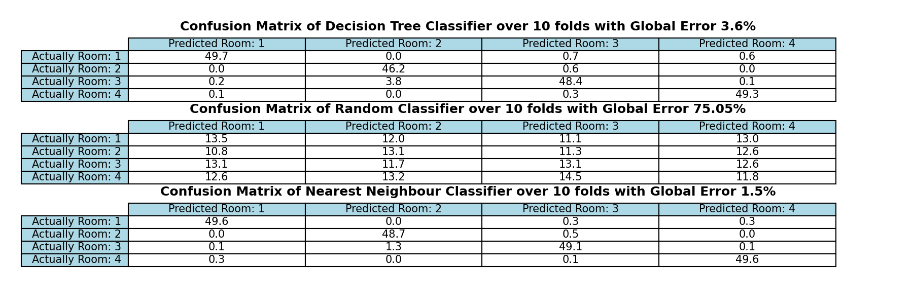
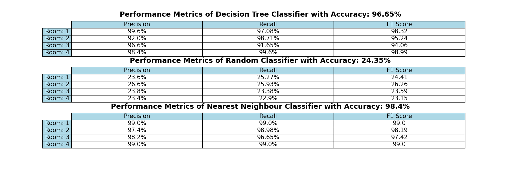

# Machine-Learning-Decision-Trees
Group Members:  
Edward Chen (ec1221)  
Mubaarak Khan (mmk120)  
Omar Ben-Gacem (ob420)  

## Running the Project
`main.py` has been setup to take in 2 arguments `<dataset path>` and `<depth>`  

 Use `python main.py <dataset path> <depth> <operating_mode>` to run the project  
 e.g:  
 `python main.py "WIFI_db/clean_dataset.txt" 12 show_tree`

 ### Operating Modes
 | operating_mode | Function  |
 | ---------------|---------- |
 |  show_tree  |  generates an interactive MatPlotLib figure to view the tree. Note that all nodes will appear as circles, and upon clicking on the node, a popup will appear and give information on the node  |
 |  metrics  |  Update the tables of the Confusion Matrix and the Performance Metrics and place them in the figures file |
 | depth_benchmark | Update the figures regarding the performance of the decision tree for various depths |

## Reccomended Depth Parameters
Multiple Trials were run (plotted below) to find the optimal depth parameter for both the clean and noisy datasets. The Plots are shown below

Clean Dataset Depth Optimisation |  Noisy Dataset Depth Optimisation
:-------------------------:|:-------------------------:
  |  

Both Plots Plateau for a certain depth, **when running the clean dataset, it is reccommended you use a depth of 12, and for the noisy dataset, it is reccomended you use a depth of 24**. This will give the best performance of the model on each dataset. You can run the clean dataset at a depth of 24, however ths will yeild no additional performance.

## Running Different tests

### Visualising the Tree
To visualise the tree, uncomment