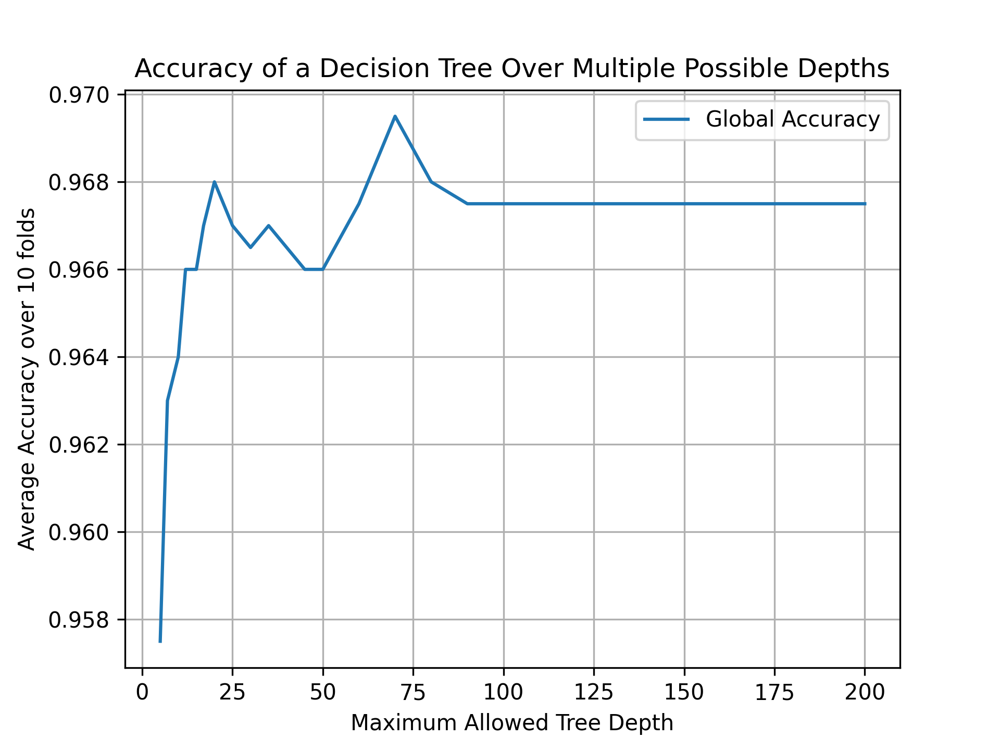
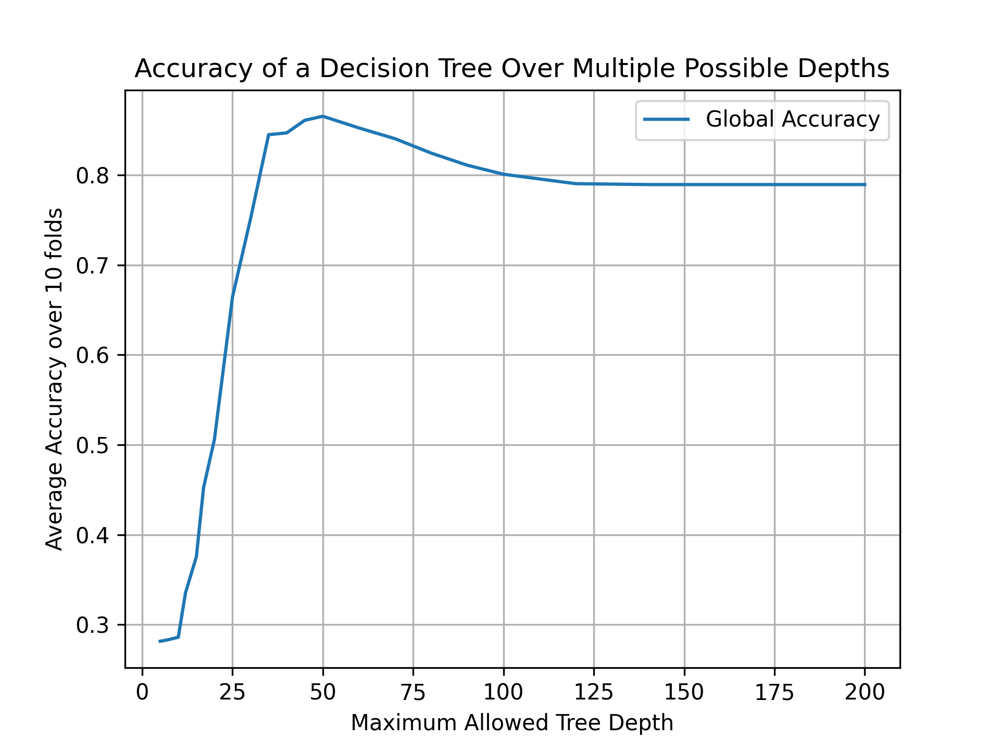

# Machine-Learning-Decision-Trees
Group Members:  
Edward Chen (ec1221)  
Mubaarak Khan (mmk120)  
Omar Ben-Gacem (ob420)  

## Running the Project
`main.py` has been setup to take in 3 arguments `<dataset path>`, `<depth>`, and `<operating_mode>`  

 Use `python main.py <dataset path> <depth> <operating_mode>` to run the project in a potential mode. All possible modes are described below  
 e.g:  
 `python main.py "WIFI_db/clean_dataset.txt" 20 "metrics"`

 ### Operating Modes
 | operating_mode  | Function  |
 | --------------- |---------- |
 |  "show_tree"      |  generates an interactive MatPlotLib figure to view the tree. Note that all nodes will appear as circles, and upon clicking on the node, a popup will appear and give information on the node  |
 |  "metrics"        |  Update the tables of the Confusion Matrix and the Performance Metrics and place them in the figures file. This may take a  minutes to run. |
 | "depth_benchmark" | Update the figures regarding the performance of the decision tree for various depths. Note in this instance the depth field is ignored, and instead plots all data from 4 to 70. **NOTE**: This computation takes a long time to run, see *Reccomended Depth Parameters* For the output of this test when run in advance |
 | "normal"          | Plot the normal distribution of the accuracy for all three Classification Methods over 10 Folds  |

## Reccomended Depth Parameters
Multiple Trials were run (plotted below) to find the optimal depth parameter for both the clean and noisy datasets. The Plots are shown below

Clean Dataset Depth Optimisation |  Noisy Dataset Depth Optimisation
:-------------------------:|:-------------------------:
  |  
*Note the differing scales in the figures*

Both Plots Plateau for a certain depth. To prevent overfitting, it is reccomended you run the trees at their optimal depth. **when running the clean dataset, it is reccommended you use a depth of 20, and for the noisy dataset, it is reccomended you use a depth of 45**. This will give the best performance of the model on each dataset. You can run the clean dataset at a depth of 24, however ths will yeild no additional performance.

